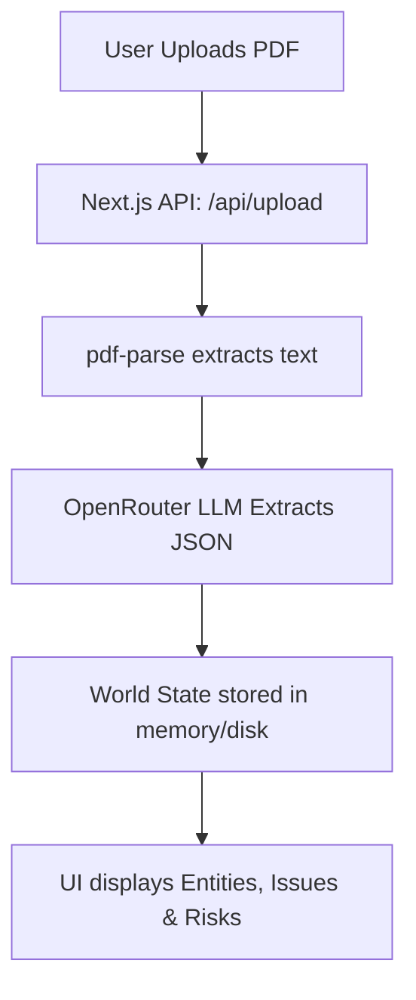
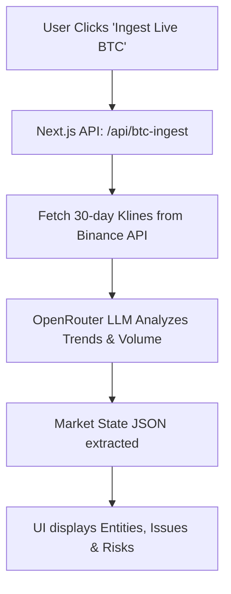
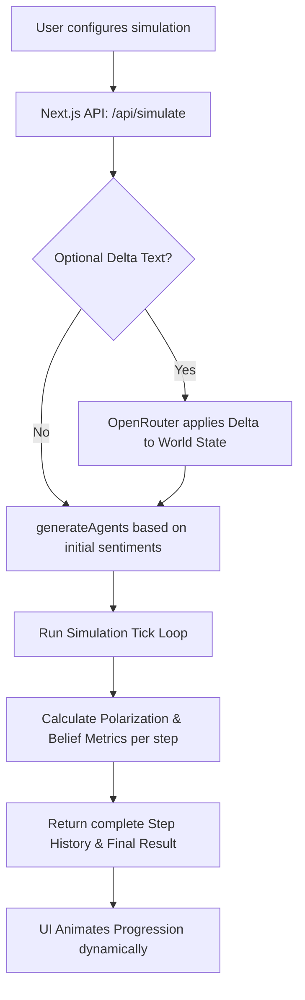
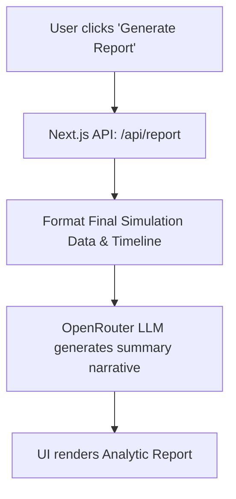

# MicroFish 🐟

A minimal, production-grade Next.js web application for simulating predictive scenarios using an agent-based model powered by OpenRouter LLM.

## Overview

MicroFish uses Large Language Models to extract a structured **World State** (Entities, Issues, Risks) from uploaded PDF documents **OR from Live Bitcoin Price data**. It then deploys an agent-based simulation engine to run behavioral interactions between dynamically generated archetype agents (e.g., government, public, military, media OR whales, retail, miners, bots) over a series of steps. Finally, it uses AI to summarize the simulated timeline and resulting polarization into a narrative report.

## Flowcharts

### 1A. Ingestion Flow (PDF to Geopolitical World State)


### 1B. Ingestion Flow (Live BTC to Crypto Market State)


### 2. Simulation Loop (Agents to Metrics)


### 3. Reporting Flow (Metrics to Narrative)


## Setup & Running Locally

1. **Clone the repository:**
   ```bash
   git clone https://github.com/juggperc/microfish.git
   cd microfish
   ```

2. **Install dependencies:**
   ```bash
   npm install
   ```

3. **Configure Environment:**
   Copy the example file and add your `OPENROUTER_API_KEY`:
   ```bash
   cp .env.example .env.local
   ```

4. **Run the Development Server:**
   ```bash
   npm run dev
   ```

## Tech Stack
- **Framework:** Next.js 15 (App Router)
- **Language:** TypeScript
- **Styling:** Tailwind CSS, Recharts for visual plots, Lucide React for iconography
- **LLM Integration:** OpenRouter API (supports `openrouter/auto` models)
- **PDF Parsing:** `pdf-parse`

## License
MIT
